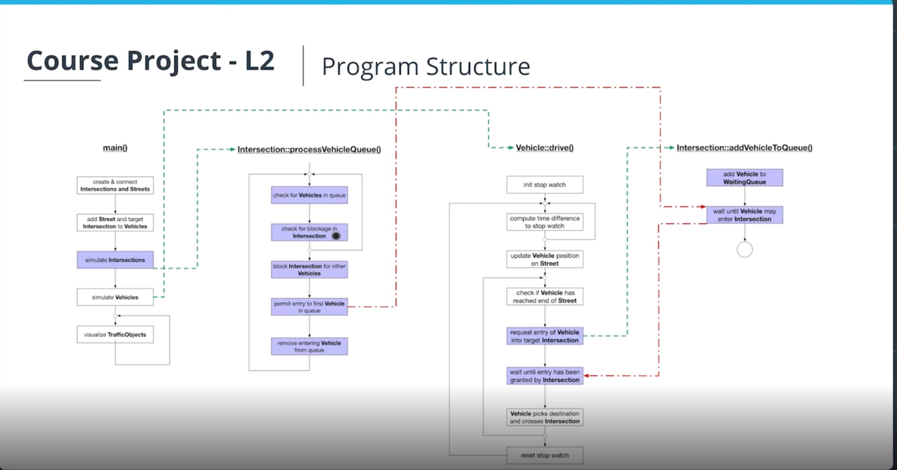

# CppNd-Traffic-Simulation

## Summary
  
  This is project Stage2.
  
  Bsed on project stage1, this project add functions, which comunicates between vehicles and intersection to ensure one 
  intersection pass one vehicle one time.
  
  **projectL2 structue**
  

## Dependencies for Buiding 

* cmake >= 2.8
  * All OSes: [click here for installation instructions](https://cmake.org/install/)
* make >= 4.1 (Linux, Mac), 3.81 (Windows)
  * Linux: make is installed by default on most Linux distros
  * Mac: [install Xcode command line tools to get make](https://developer.apple.com/xcode/features/)
  * Windows: [Click here for installation instructions](http://gnuwin32.sourceforge.net/packages/make.htm)
* OpenCV >= 4.1
  * The OpenCV 4.1.0 source code can be found [here](https://github.com/opencv/opencv/tree/4.1.0)
* gcc/g++ >= 5.4
  * Linux: gcc / g++ is installed by default on most Linux distros
  * Mac: same deal as make - [install Xcode command line tools](https://developer.apple.com/xcode/features/)
  * Windows: recommend using [MinGW](http://www.mingw.org/)
Windows: recommend using MinGW
  make `build` director in top location of project file, then do `make.. && make`, after build 
completed using command `./traffic_simulation` to run.

## Basic Build Instructions

1. Clone this repo.
2. Make a build directory in the top level directory: `mkdir build && cd build`
3. Compile: `cmake .. && make`
4. Run it: `./traffic_simulation`.

## Project Tasks

- **Task L2.1** : In method Vehicle::drive(), start up a task using std::async which takes a reference to the
method Intersection::addVehicleToQueue, the object _currDestination and a shared pointer to this using the
get_shared_this() function. Then, wait for the data to be available before proceeding to slow down.

- **Task L2.2** : In method Intersection::addVehicleToQueue(), add the new vehicle to the waiting line by
creating a promise, a corresponding future and then adding both to _waitingVehicles. Then wait until
the vehicle has been granted entry.

- **Task L2.3** : In method WaitingVehicles::permitEntryToFirstInQueue(), get the entries from the
front of _promises and _vehicles. Then, fulfill promise and send signal back that permission to enter
has been granted. Finally, remove the front elements from both queues.
